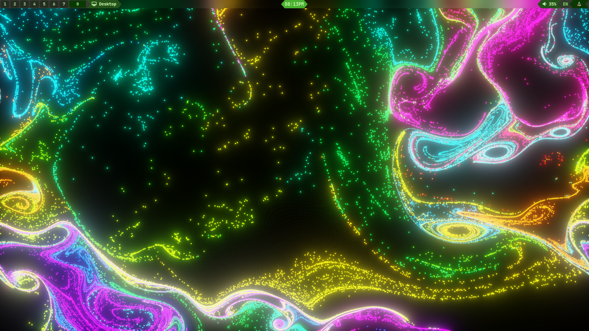
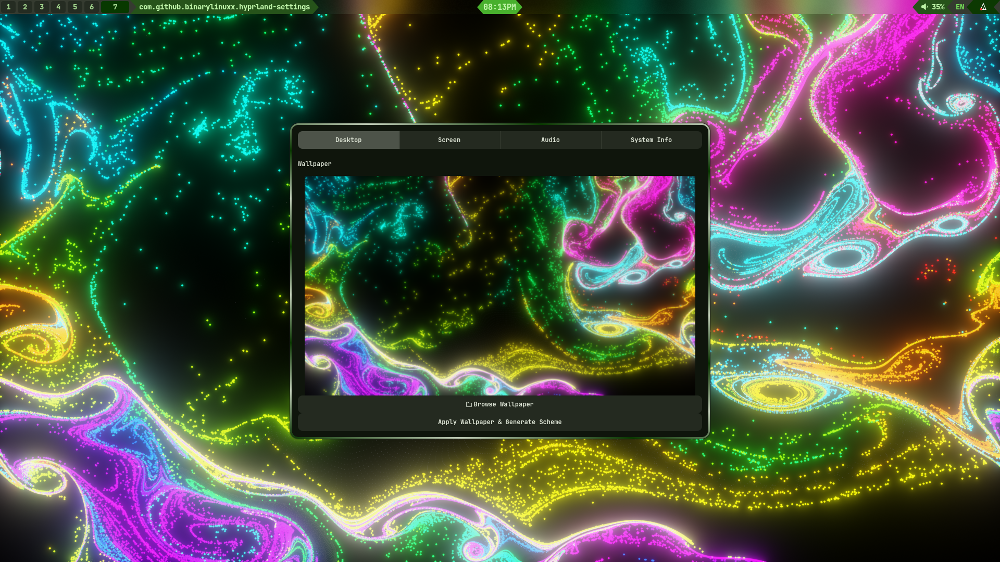
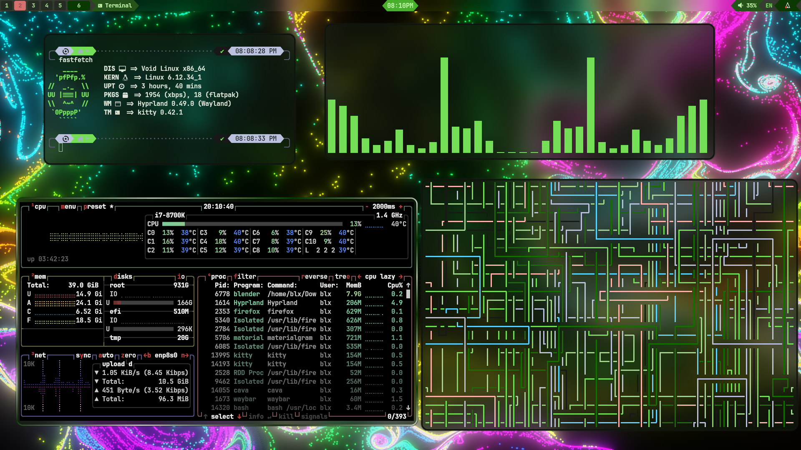
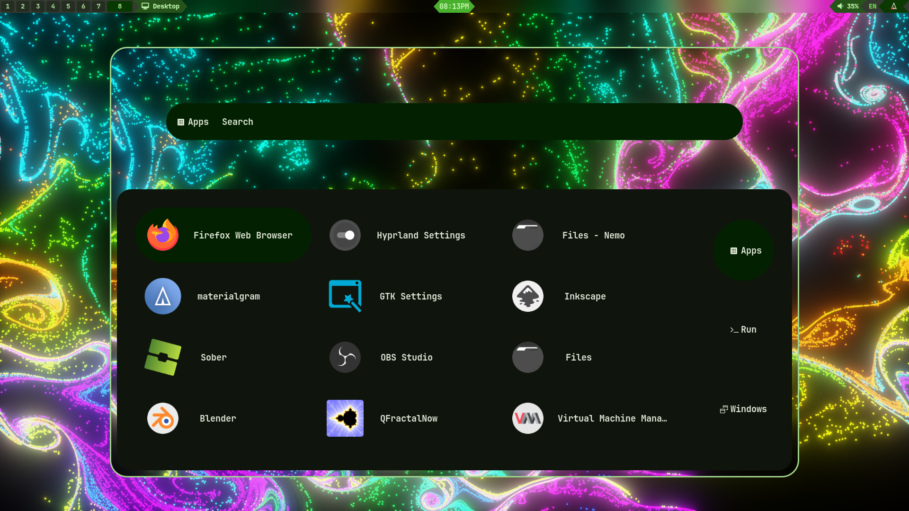
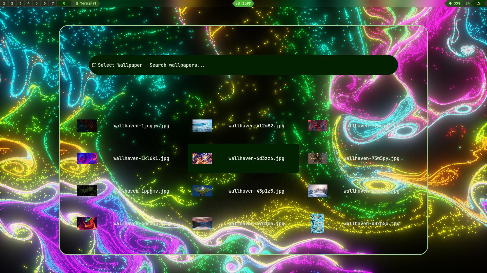

# NullDE
Minimal but useful Hypr-Environment.
NullDE is hardworked and well done by one person - myself.
So.. that's an excuse for functionality that I didn't
implemented yet due to lack of support, testing, experience and knowledge.

# SCREENS

# DESK


# CONTROL CENTER/PANEL


# SYS MONITOR WITH AUDIO VISUALIZER


# APP LAUNCHER


# WALL SELECTOR


# INSTALL
>[!NOTE]
> the bash installer are on **pre-pre-pre-Alpha!** use on your own risk and free will.
> script mostly stable but still have points needed to fix 
> and still many things to change and improve because im solo developer of all this project

- script as well guide you through a few interactive steps so you could say install process was going very customizable

**auto install:**

```
bash -c "$(curl -fsSL https://raw.githubusercontent.com/binarylinuxx/NullDE/main/install.sh)"
```

**handmade install:**

*avilable pkgs:*
```
libinput mesa-dri wayland-protocols 
xorg-server-xwayland xdg-utils xdg-user-dirs polkit 
pulseaudio pulseaudio-devel hyprlock nerd-fonts-symbols-ttf 
gtk4-layer-shell gtk4-layer-shell-devel hyprland 
xdg-desktop-portal-hyprland rofi Waybar swaybg kitty libadwita 
hyprpaper wlogout fish-shell gtk4-devel gtk4 gtk3
```

*binary builden by myself from BIN/ folder:*
```
matugen hyprsettings
```

*then clone repo:*
``` 
git clone https://github.com/binarylinuxx/NullDE
cd NullDE
cp -r .config ~/
loginctl reboot
```

# KEYBINDS YOU MIGHT LIKE TO KNOW
- <kbd>SUPER</kbd> + <kbd>RETURN</kbd>: KITTY TERMINAL
- <kbd>PRTSCN</kbd>: TAKE A SHOT(SCREENSHOT) OF SCREEN
- <kbd>SUPER<kbd> + <kbd>SPACEBAR<kbd>: APP LAUNCHER ROFI
- <kbd>SUPER<kbd> + <kbd>0 - 9<kbd>: MOVE THROUGHT WORKSPACES IN RANGE 0-9
- <kbd>SUPER<kbd> + <kbd>W<kbd>: SPAWN CONTROL PANEL for more info about control panel [click there](https://github.com/binarylinuxx/hyprsettings.git)


